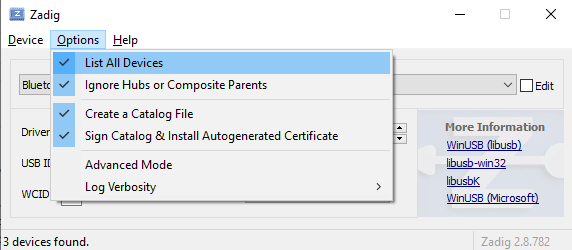

# InstructionFirmware
Instruction Firmware Atmega328P USBASP, adapter ISP

### Step 1 - Connect the programmer to the computer.
### Step 2 - Download "Zadig".
2. Download "Zadig" https://zadig.akeo.ie/  
    2.1. Open the program and select "USBASP" from the list. 
     
    2.2. If USBASP is not in the list, go to the Options -> List All Device tab. 
     
    2.3. Select Target driver libusbK and click on the button "Upgrade Driver". 
     
    2.4. Upon completion, the message "The driver was installed successfully" will appear. 
     
### Step 3 - Download "ProgISP".
3. Download and unpack the archive "progisp172.rar". 
    3.1. Open the program "progisp.exe" and select "ATmega328P". 
     
    3.2. Make sure "PRG ISP" is active. 
     
    3.3. Click on the window (look image). 
     
    3.4. Set the fuses as in the picture and click on the "Write" button. 
     
    3.5. Check the box next to "Program Flash". 
    3.6. Set File -> Load Flash. Select "firmware.hex" file. 
    3.7. Click the button "Auto" for download firmware.
   
    
